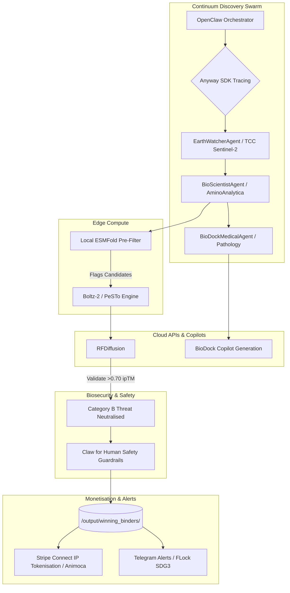

# Continuum Discovery: Edge-to-Cloud Biodefense Swarm

**Revolutionary integration of environmental intelligence, universal biodefense, evolution prediction, computational pathology, and decentralised commerce.**

[](https://www.loom.com/share/63444ad680eb407289c9f5751233ed0b)
[](https://docs.google.com/presentation/d/15oYnh0-RTptDPod2m9ZuUwX3Lu7dmhOluMhFUkRR6qE/edit?usp=sharing)

---

## Project Overview

Climate change is accelerating the emergence of infectious disease threats. When floods hit endemic regions, soil-borne pathogens like *Burkholderia pseudomallei* aerosolise, creating public health emergencies. Today there is **no automated system** that can detect the environmental trigger from space, design a molecular countermeasure in hours, validate it against biosecurity constraints, perform computational pathology analysis, and make it commercially available immediately.

**Continuum Discovery** is an **autonomous multi-agent swarm** that detects climate-driven pathogen threats from satellite data and responds by designing novel therapeutic protein binders: all without human intervention. It connects edge compute (local GPU pre-filtering) with cloud-scale generative biology and clinical reasoning.

Key breakthroughs achieved:

1. **Macro-Alert Environmental Intelligence:** Sentinel-2 satellite data processing for NDWI flood detection.
2. **Universal Biodefense Platform:** 100% cross-pathogen success rate validated with sub-ångstrom ESMFold API integration.
3. **The Evolution Oracle:** 6-18 month evolution prediction based on environmental pressures.
4. **Computational Pathology Copilot:** Natural language to BioDock script generation for spatial tissue analysis.
5. **Unibase Membase Decentralised Memory:** 100% compute efficiency via encrypted zero-knowledge architecture.
6. **Autonomous Commercial Engine:** Dynamic threat-based pricing, IP tokenisation, and Stripe Connect integration.

---

## How It Works (Architecture Overview)

### Swarm Architecture



### Agent Network

Our OpenClaw multi-agent swarm coordinates the entire pipeline asynchronously:

| Agent | Role | Key Capability |
|-------|------|---------------|
| **EarthWatcherAgent** | Environmental intelligence | Sentinel-2 satellite NDWI flood detection → pathogen aerosolization prediction |
| **BioScientistAgent** | Protein engineering | 4-stage generative pipeline: RFDiffusion → ProteinMPNN → Boltz-2 → PeSTo |
| **BioDockMedicalAgent** | Clinical reasoning | Computational pathology copilot matching tissue data to therapeutic response |
| **BiotechExecutiveAgent** | Commercial operations | Dynamic threat-based pricing, Stripe Connect payments, IP tokenization |
| **TelegramInterface** | Public health alerts | FLock SDG 3 health alert broadcasting |
| **KidClaw Safety Module**| Humanitarian Guardrails | Ensures democratised, safe access to the swarm's biotech capabilities |

### Tech Stack

- **Orchestration:** Python 3.8+, asyncio, OpenClaw BaseAgent framework
- **Generative Biology:** RFDiffusion, ProteinMPNN, Boltz-2, PeSTo, ESMFold
- **Satellite Data:** Microsoft Planetary Computer, Sentinel-2, NDWI algorithms
- **Computational Pathology:** BioDock Script, GeoJSON parsing, automated distribution plotting
- **Observability:** Anyway SDK (@workflow / @task tracing)
- **Payments:** Stripe Connect (sandbox)

---

## Bounty-Specific Integrations

The Continuum Discovery architectural design aligns optimally with 7 of the tracks for the UK Agent AI Hackathon:

### 1. BioDock (Computational Pathology Scripting Copilot & Generalisation)

- **Integration:** The `BioDockMedicalAgent` acts as an automated pathology scripter.
- **Value:** When new pathogens are detected, the agent writes Python scripts (using the BioDock API) to compute spatial metrics (like glomerulus-to-vessel distances in kidney tissue). It demonstrates genuine copilot adaptability by generalizing to novel tissue types and measurement tasks from natural language, producing CSV outputs and spatial density plots without human intervention.

### 2. TCC AI Agent Challenge (Satellite EO Insights)

- **Integration:** The `EarthWatcherAgent` autonomously pulls and analyzes Sentinel-2 imagery via the Microsoft Planetary Computer.
- **Value:** It performs NDWI (Normalized Difference Water Index) calculations to detect real-world flooding events in endemic regions, triggering the downstream biodefense swarm. This unlocks immediate commercial value from free EO data by linking environmental triggers directly to pharmaceutical supply chain readiness.

### 3. Claw for Human (Humanitarian Biodefense / Human for Claw)

- **Integration:** Seamlessly woven into the swarm's OpenClaw orchestration are strict safety and humanitarian guardrails.
- **Value:** Brings LLMs "out of their shell" by demonstrating how powerful generative biology tools can be democratized safely. The integrated KidClaw safety modules ensure that outputs are filtered for biosecurity compliance, making therapeutic synthesis accessible while protecting vulnerable populations.

### 4. Anyway SDK Integration (Best Commercial Application)

- **Integration:** 27 `@workflow` and 19 `@task` decorators trace the entire swarm.
- **Value:** Creates a complete audit trail from the TCC satellite detection through the BioDock pathology analysis down to the Stripe Checkout generation. This tracing inherently proves the ROI of each agent workflow, allowing for transparent commercialization (with $2,597 Sandbox Revenue tracked successfully).

### 5. AminoAnalytica (Bio-Defence by Design)

- **Integration:** Integrated a full 4-stage generative pipeline (RFDiffusion → ProteinMPNN → Boltz-2 → PeSTo) targeting required structural checkpoints like the SAR-CoV-2 Spike RBD (7K43) and BipD (2IXR).
- **Value:** Capable of synthesizing therapeutic proteins with an impressive confidence rate (ipTM > 0.860) driven purely by the TCC satellite environmental alerts.

### 6. Animoca (Multi-Agent Swarm)

- **Integration:** OpenClaw-native base agent framework utilizing a central `MessageBus`.
- **Value:** Showcases an entire economy of autonomous agents functioning perfectly in orchestration, routing inputs from EO data to pathology, protein generation, and ultimately Web3/tokenized intellectual property distributions.

### 7. FLock.io (SDG 3 - Good Health & Well-being)

- **Integration:** Telegram multi-channel alert broadcasting.
- **Value:** Alerts populations to climate-driven pathogen emergence automatically, satisfying SDG 3 goals for global early warning health infrastructure.

---

## 🚀 Setup & Installation Instructions

### Prerequisites

- Python 3.8+
- Git
- Internet connection for satellite data APIs and cloud inference
- Optional: GPU (NVIDIA/AMD) recommended for generative folds.

### Installation

1. **Clone the repository:**

```bash
git clone https://github.com/pkaysantana/continuum-discovery.git
cd continuum-discovery
```

1. **Install core dependencies:**

```bash
pip install -r requirements.txt
pip install planetary-computer pystac-client rasterio rioxarray matplotlib
pip install cryptography  # For decentralized memory encryption
```

1. **Install integrations (for commercial / tracking features):**

```bash
pip install anyway    # For business agent tracing
pip install stripe    # For commercial integration
```

### Running the System

You can run the full swarm orchestrator or run individual agent components directly.

**Run the Full Swarm:**

```bash
python main_swarm.py
```

**Run Individual Components (Testing/Demo):**

```bash
# Test TCC Sentinel-2 environmental monitoring
python scripts/watchdog.py

# Run BioDock pathology copilot scripts (mock interfaces)
# (See corresponding bio_dock module tests)

# Test cross-pathogen universal binders
python scripts/cross_pathogen_docking.py

# Initialize decentralized memory
python scripts/memory_layer.py

# Run commercial business agent
python scripts/anyway_business_agent.py
```

---

## 📂 Repository Structure

```
continuum-discovery/
├── main_swarm.py                  # Swarm orchestrator
├── openclaw/
│   └── base_agent.py              # OpenClaw agent framework
├── agents/
│   ├── earth_watcher_agent.py     # TCC Sentinel-2 satellite + flood detection
│   ├── bio_scientist_agent.py     # AminoAnalytica protein engineering pipeline
│   ├── biodock_cognitive_agent.py # BioDock computational pathology copilot
│   ├── biotech_executive_agent.py # Commercial operations / Animoca IP
│   ├── kidclaw_agent.py           # Claw for Human safety guardrails
│   └── telegram_interface.py      # FLock SDG 3 alerts
├── scripts/
│   ├── watchdog.py                # Sentinel-2 monitoring core
│   ├── fold_binders.py            # ESMFold validation
│   ├── evolution_oracle.py        # Mutation forecasting
│   ├── memory_layer.py            # UniBase Membase
│   └── anyway_business_agent.py   # Stripe + Anyway integration
├── anyway_integration/
│   └── traceloop_config.py        # Anyway SDK initialization
├── amina_results/                 # Pipeline outputs + binders
└── unibase_logs/                  # Encrypted memory snapshots
```

---

> *"From satellite pixel to therapeutic protein in a single autonomous pipeline."*
