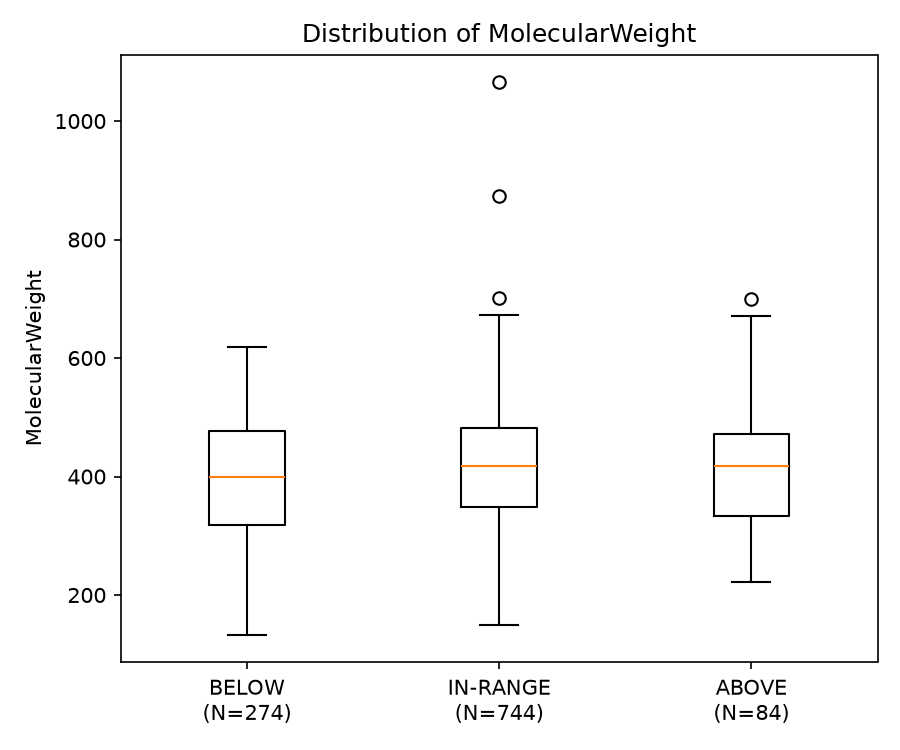
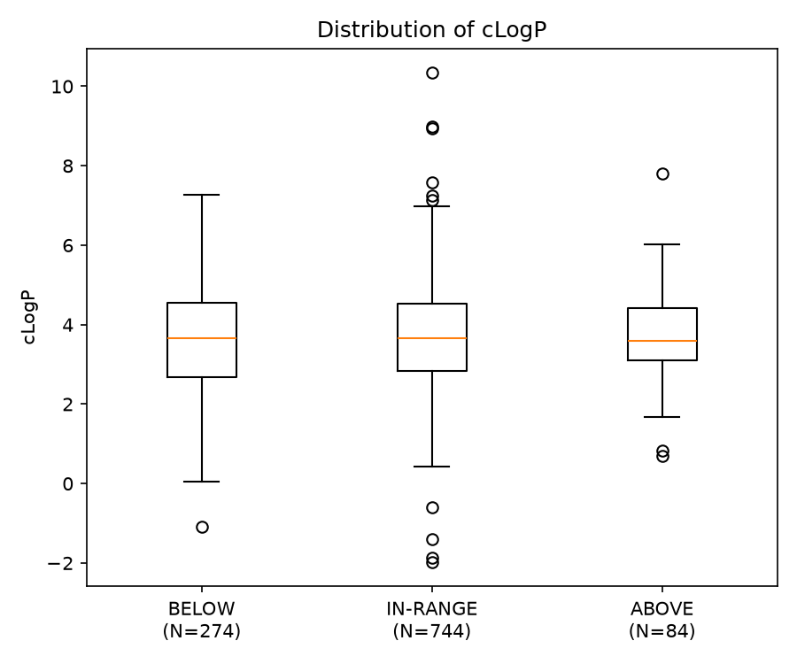
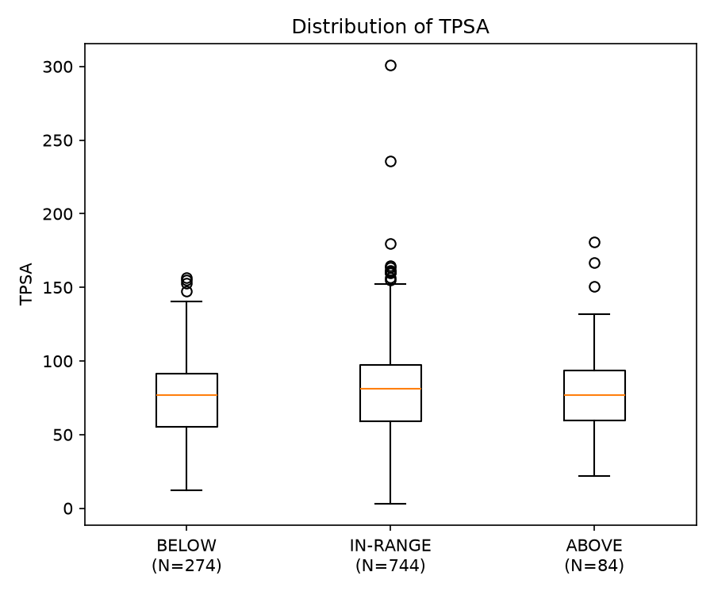
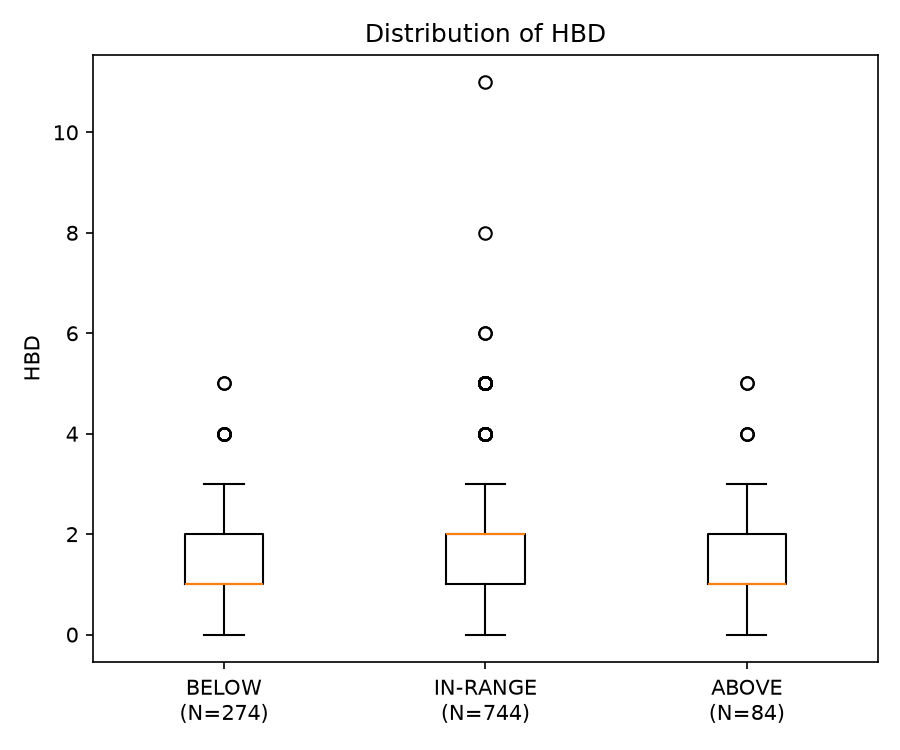
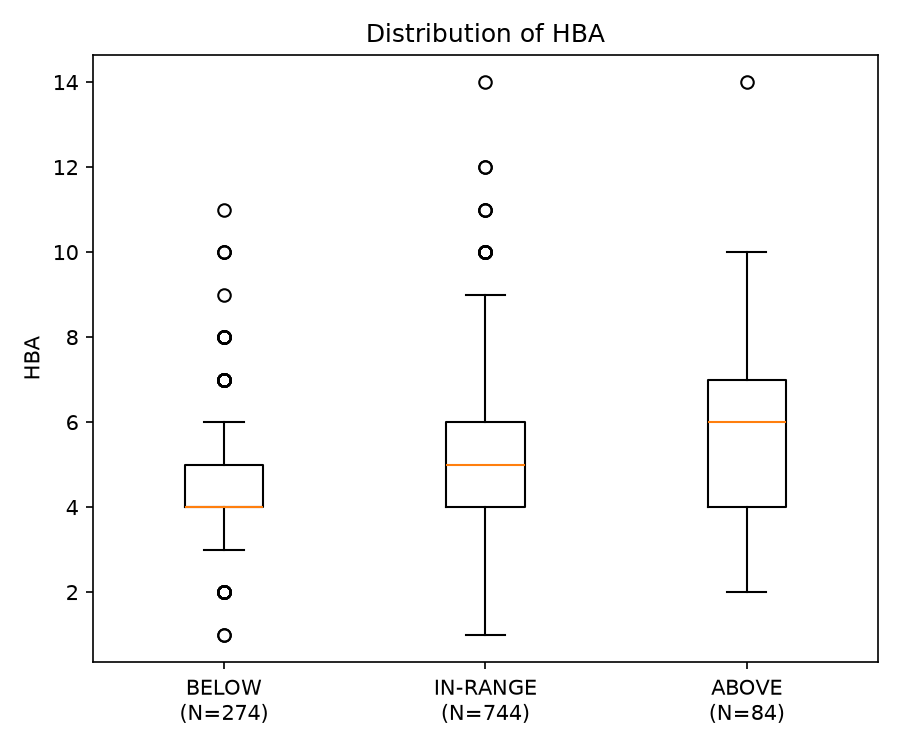
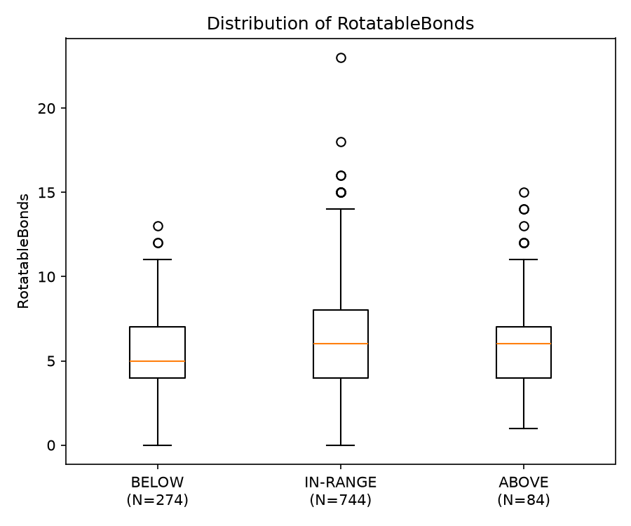
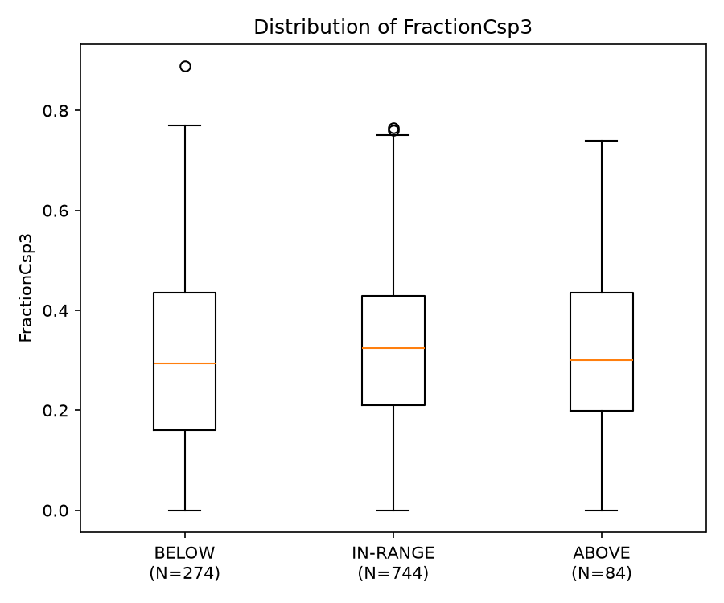

# U6 Descriptor Analysis

**Purpose**: Descriptive molecular-property analysis of the DMPK compound-to-exposure project cohort before any predictive modelling.
**Cohort**: Primary HLM classifier cohort (N=1,102).
**Class Counts**: BELOW (N=274), IN-RANGE (N=744), ABOVE (N=84).
**Exact Descriptors**: 
- Molecular Weight
- Crippen cLogP
- TPSA
- H-bond donors
- H-bond acceptors
- Strict rotatable-bond count
- Fraction Csp3
**Exact Structural Handling**: Provenance canonical structure; all disconnected components retained; stereochemistry retained; no salt stripping; no parent selection; no tautomer normalisation.

## Descriptive Statistics
See `U6_DESCRIPTOR_SUMMARY.csv` for exact quantiles (Median, Q1, Q3, Min, Max).

## Visualisations

### MolecularWeight

### cLogP

### TPSA

### HBD

### HBA

### RotatableBonds

### FractionCsp3

## Declarations
* **NO inferential testing was performed.** (No p-values, ANOVA, Kruskal-Wallis, etc.)
* **These results CANNOT modify any modelling choice.** They are strictly descriptive.
